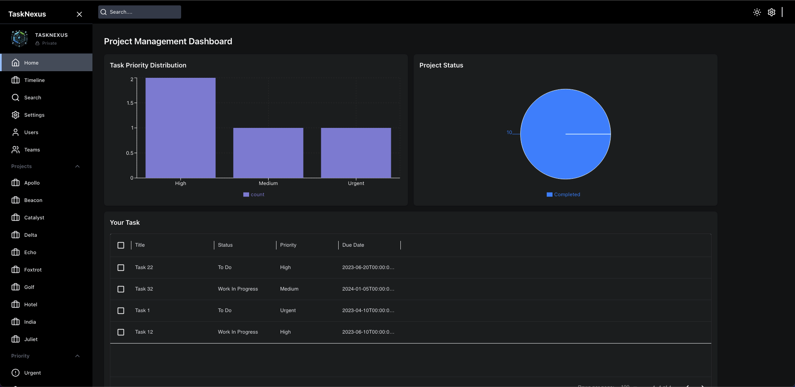
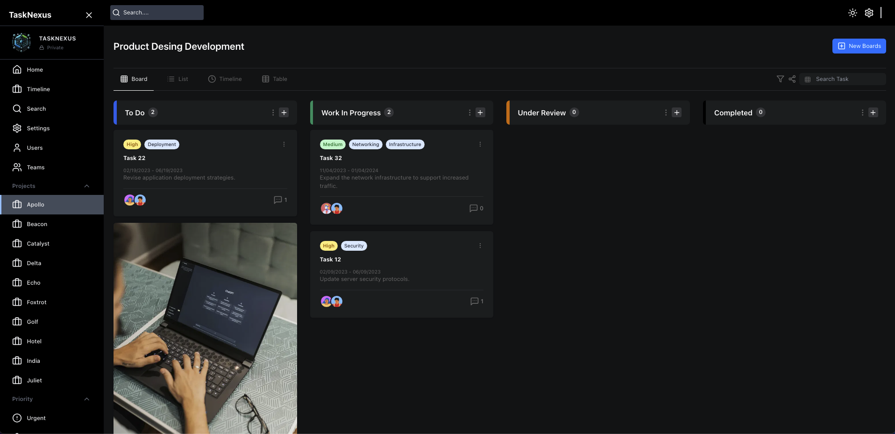
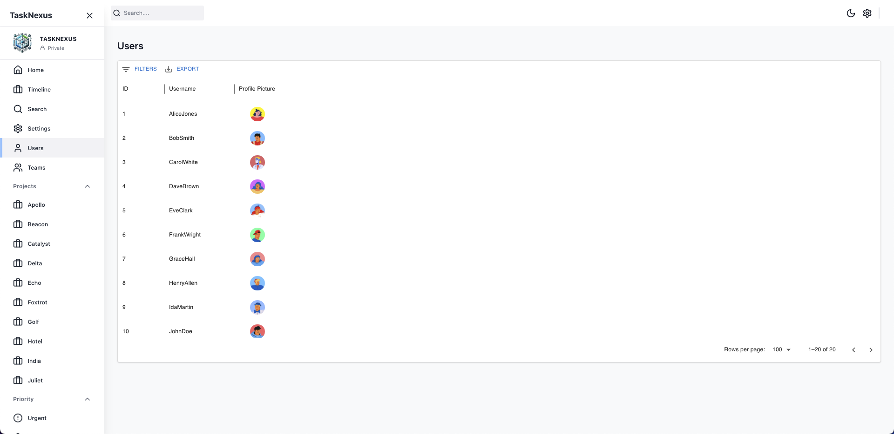
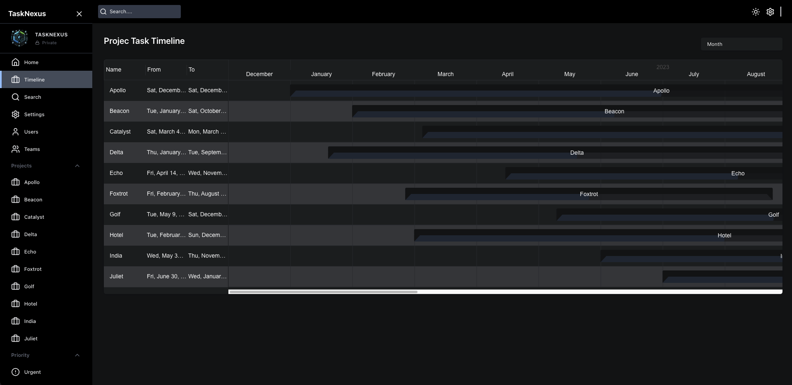

# TaskNexus

# TaskNexus

TaskNexus is a full-featured, modern project management application that provides a comprehensive and intuitive way to manage and track projects efficiently. Designed to showcase skills in building a robust full-stack application, it leverages Next.js, React, Redux, Node.js, Express.js, PostgreSQL, and AWS services to deliver an experience that focuses on functionality, flexibility, and performance.

## Live Demo

[View TaskNexus Live](https://main.d1e95r8g301kjf.amplifyapp.com/)

---

## Features

- **Drag and Drop Functionality:** Easily move tasks between different stages of a project (To Do, Work In Progress, Under Review, Completed) using drag-and-drop.
- **Priority-Based Task Management:** Categorize tasks based on priority levels: Urgent, High, Medium, Low, and Backlog.

- **Multiple Views for Projects:**

  - **Board View:** Provides a visual kanban-style view with drag-and-drop functionality for easy task movement.
  - **List View:** Displays all tasks in a comprehensive list for a quick overview.
  - **Timeline View:** Shows project milestones, deadlines, and progress over time.
  - **Table View:** Allows detailed, tabular data representation for granular project details.

- **Modern and Intuitive UI:** Designed with TailwindCSS for a responsive, sleek, and user-friendly interface, including support for both Dark and Light modes.

- **Team & User Management:** Manage users and teams efficiently. Store user settings and preferences securely.

- **Full Flexibility in Task Management:** Create, update, and delete tasks seamlessly, along with assigning priorities, deadlines, and managing teams within the project.

## Tech Stack

### Frontend

- **Next.js:** Fast and optimized server-rendered React applications.
- **React & Redux:** State management handled with Redux Toolkit for efficient data flow and Redux Query for API interactions.
- **TailwindCSS:** Custom styling for the modern look of the application with support for light and dark themes.
- **React DnD:** Handles drag-and-drop functionality seamlessly for moving tasks across stages.
- **MUI DataGrid & Gantt Charts:** Provides data-rich UI components for displaying tasks and timelines.

### Backend

- **Node.js & Express.js:** RESTful API server setup for handling task management, user authentication, and data flow between the front end and the database.
- **PostgreSQL & Prisma ORM:** Relational database management for storing user, team, and task data. Prisma provides an efficient, type-safe way to interact with the database.
- **PGAdmin:** Local development tool for managing and visualizing the PostgreSQL database.
- **pm2:** Production process manager for running the backend continuously and ensuring server uptime.

### AWS Services

- **AWS EC2 (Elastic Compute Cloud):** Hosts the backend server, ensuring scalability and reliability.
- **AWS RDS (Relational Database Service):** Managed PostgreSQL database service for persistent and scalable data storage.
- **AWS API Gateway:** Acts as the entry point for API requests, ensuring secure and efficient routing of data between the frontend and backend.
- **AWS Amplify (for Frontend Hosting):** Hosts the Next.js front end with seamless CI/CD pipelines.
- **AWS S3 (Simple Storage Service):** Secure and scalable storage for any static assets.
- **AWS VPC (Virtual Private Cloud):** Provides network isolation and security using subnets, route tables, and internet gateways.

### Development Tools

- **Prisma:** Type-safe database schema and query management.
- **Thunder Client:** Lightweight API testing tool used for testing backend endpoints.
- **pm2:** Ensures the Node.js server runs continuously, even in production.

## Design Architecture

The TaskNexus architecture follows a modular, microservice-inspired approach, focusing on separation of concerns, scalability, and maintainability. Below is an overview of the design principles and patterns applied:

### Backend Architecture

- **RESTful API Layer:** The backend is built using Node.js and Express, structured to provide a clean RESTful API for client-server interactions. Each route is defined for various CRUD operations related to users, tasks, teams, and project management, ensuring clear endpoints for front-end consumption.
- **Database Access Layer with Prisma:** Prisma acts as the Object-Relational Mapping (ORM) layer, abstracting the database interactions while enforcing type safety and reducing the boilerplate code for database operations. All queries are type-safe and easy to manage, and Prisma's migration tools ensure smooth database versioning.

- **Scalable Deployment:** The backend, hosted on AWS EC2, leverages pm2 to run and manage the Node.js server continuously, providing high availability and reliability. AWS RDS is used for data persistence, while VPC ensures a secure and isolated network environment.

### Frontend Architecture

- **Component-Based Structure:** The front end follows React’s component-based architecture, modularizing UI elements for easy reuse, testing, and maintenance. Each view (Board, List, Timeline, Table) is treated as a separate component, rendering dynamic content based on state.
- **State Management with Redux Toolkit:** Redux is used to maintain a centralized store for all application states (tasks, projects, users). This allows efficient data flow across components and enhances state predictability, providing actions and reducers to manage various project management workflows.

- **Server-Side Rendering & Code Splitting:** Utilizing Next.js capabilities for SSR to improve SEO and load times, and code splitting for efficient bundle sizes, ensuring a fast and responsive user experience.

## Design Patterns

TaskNexus uses several design patterns to ensure code readability, maintainability, and efficient data flow:

- **Singleton Pattern (Backend):** Ensures a single instance of database connections (Prisma Client) throughout the application to optimize resource usage and maintain consistency.

- **Observer Pattern (Frontend - Redux):** Redux acts as a central store that follows an observer pattern. Whenever a change in state occurs (tasks updated, project status changed), all subscribed components re-render accordingly.

- **Factory Method Pattern (Backend):** Provides a way to create different types of project entities (task, team, user) based on specific criteria without exposing the creation logic, centralizing and encapsulating the object instantiation.

- **Adapter Pattern (Backend & Frontend):** Adapters are used to transform the structure of API responses and requests. For example, when data is retrieved from the database, it’s transformed into a format compatible with the front end, ensuring smooth data integration across the stack.

## UI Snapshots

### Home Page

### Project Management Dashboard

### User Management

### Project Timeline View

---

## Infrastructure Overview

TaskNexus is designed as a fully functional, highly scalable, and modular application. The integration of AWS services enables a robust deployment pipeline, ensuring efficient networking, data security, and quick scaling capabilities.

### Frontend Highlights

- **Dynamic Routing & Code Splitting:** Utilizing Next.js capabilities for efficient page loading and improved user experience.
- **State Management with Redux Toolkit:** Provides centralized state control, including task prioritization, user settings, and project workflows.
- **Theming & Responsiveness with TailwindCSS:** Seamless theming for dark and light modes, and responsive design for use across various devices.

### Backend Highlights

- **RESTful API Endpoints:** Node.js and Express.js power the backend for creating, updating, and managing all project data.
- **Database Layer with PostgreSQL & Prisma:** Provides efficient data storage, access control, and relationship management between users, teams, and tasks.
- **Security & Access Control:** AWS VPC for secure networking and API Gateway for securely handling data requests.

### AWS Infrastructure

- **Compute & Network (EC2, VPC):** Backend hosted on EC2, within a securely isolated VPC for performance and security.
- **Storage & Databases (RDS, S3):** Persistent data storage in AWS RDS for PostgreSQL. All static assets and media are securely stored in AWS S3.
- **API Gateway:** Ensures secure and efficient routing of API requests.
- **Continuous Deployment with Amplify:** The frontend is hosted and deployed using AWS Amplify, ensuring quick and efficient updates.

---

Feel free to explore the live application and experience the flexibility and features of TaskNexus in managing your projects effectively.
